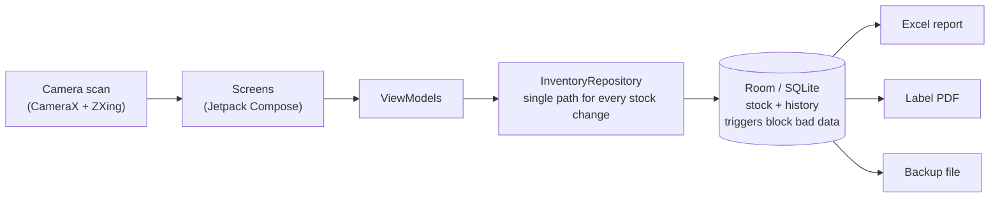
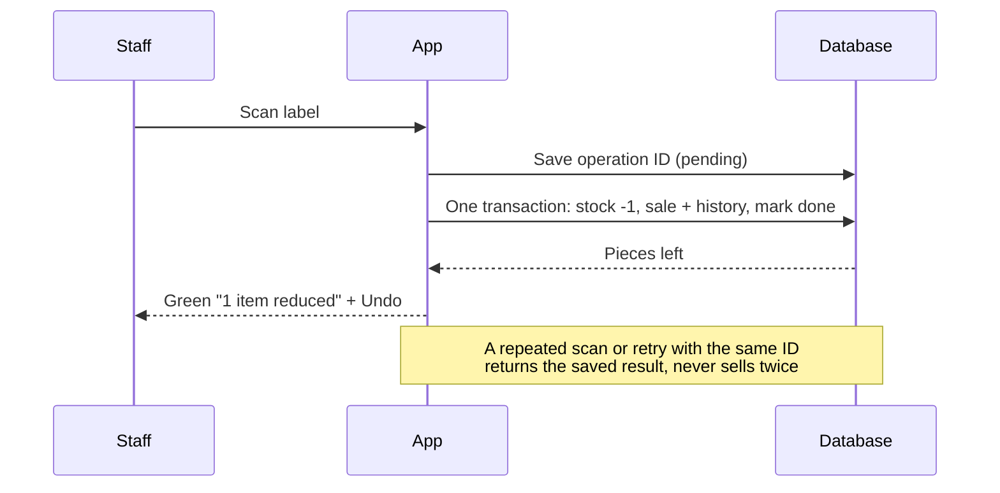

# C Nanjappa Cloth Center — Inventory

Offline Android app for a clothing shop. Scan a garment's barcode to sell it, add products and stock, record returns, and export Excel reports, labels and backups. No internet, account or subscription needed.

## Features

- **Sell by scanning:** each scan sells exactly 1 piece, with Undo.
- **Uses existing barcodes:** EAN, UPC, Code 128/39, QR and Data Matrix. No printing needed.
- **Returns:** only against a recorded sale, including damaged returns.
- **Products:** company, name, model, colour, size and Full/Half sleeve, with optional notes.
- **Stock:** add stock, or correct it with a reason. Search all stock, with a size breakdown.
- **Exports:** Excel stock report, barcode label PDF, and checked backup and restore.

## How it works





## Build and run

You need Android Studio (or its bundled JDK). Phones need Android 8.0 or newer.

```bash
git clone https://github.com/dhyanagni2001-commits/CNCC_Inventory_Android.git
cd CNCC_Inventory_Android/MyApplication
export JAVA_HOME="/Applications/Android Studio.app/Contents/jbr/Contents/Home"

./gradlew :app:assemblePreview    # optimised test build
adb install -r app/build/outputs/apk/preview/app-preview.apk
```

The release APK (`./gradlew :app:assembleRelease`) must be signed with the shop's own key. This repository contains no keys.

## Tests

```bash
./gradlew :app:testDebugUnitTest          # 26 unit tests, no device needed
./gradlew :app:connectedDebugAndroidTest  # 28 device tests, needs an emulator or phone
```

All 54 tests pass on the emulator (API 37). The tests run in a separate `.debug` app, so they never touch real shop data.

**Not yet verified:** a real phone, the camera on real labels, printing, and large stock lists.

## Project layout

```
MyApplication/app/src/main/java/com/cnanjappa/inventory/
├── domain/   size, colour and barcode rules
├── data/     database and InventoryRepository
├── scan/     camera barcode scanner
├── export/   Excel, labels, backup
└── ui/       screens
```

For more detail, see [MyApplication/NOTES.md](MyApplication/NOTES.md) and [android_inventory_requirements.md](android_inventory_requirements.md).

## Licences

AndroidX, Compose, Room, CameraX and ZXing are under Apache 2.0. The Inter font is under SIL OFL 1.1 (see [licence](MyApplication/INTER_FONT_LICENSE.txt)).
