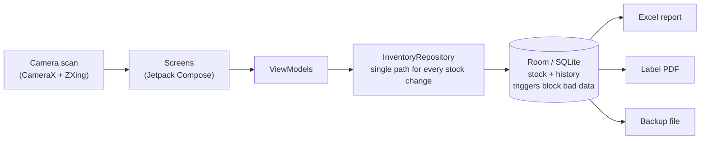
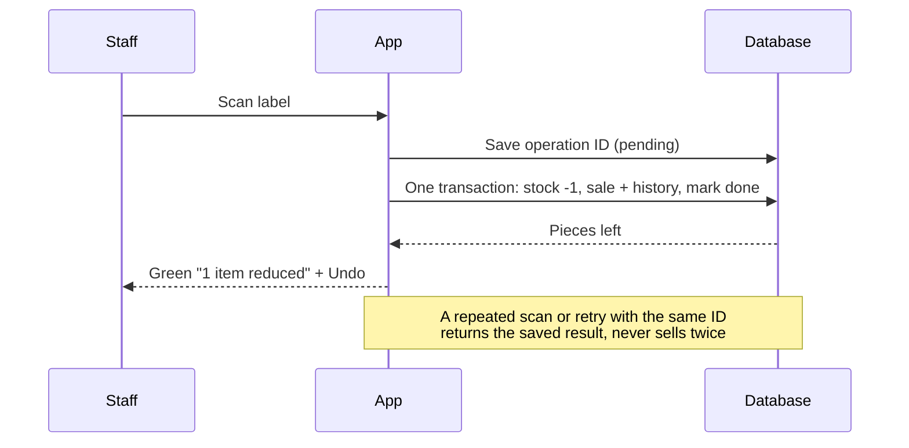

# C Nanjappa Cloth Center — Inventory

Offline Android app for a clothing shop. Scan a garment's barcode to sell it, add products and stock, record returns, and export Excel reports, labels and backups. No internet, account or subscription needed.

## Features

- **Sell by scanning:** each scan sells exactly 1 piece, with Undo.
- **Uses existing barcodes:** EAN, UPC, Code 128/39, QR and Data Matrix. No printing needed.
- **Returns:** only against a recorded sale, including damaged returns.
- **Products:** company, name, model, colour, size and Full/Half sleeve, with optional notes.
- **Stock:** add stock, or correct it with a reason. Search all stock, with a size breakdown.
- **Exports:** Excel stock report, barcode label PDF, and checked backup and restore.

## How it works





## Build and run

You need Android Studio (or its bundled JDK). Phones need Android 8.0 or newer.

```bash
git clone https://github.com/dhyanagni2001-commits/CNCC_Inventory_Android.git
cd CNCC_Inventory_Android/MyApplication
export JAVA_HOME="/Applications/Android Studio.app/Contents/jbr/Contents/Home"

./gradlew :app:assemblePreview    # optimised test build
adb install -r app/build/outputs/apk/preview/app-preview.apk
```

The release APK (`./gradlew :app:assembleRelease`) must be signed with the shop's own key. This repository contains no keys.

## Tests

```bash
./gradlew :app:testDebugUnitTest          # 26 unit tests, no device needed
./gradlew :app:connectedDebugAndroidTest  # 28 device tests, needs an emulator or phone
```

All 54 tests pass on the emulator (API 37). The tests run in a separate `.debug` app, so they never touch real shop data.

### Stress test (10,000 products)

```bash
cd MyApplication
scripts/stress.sh 300             # 300 = seconds of UI scrolling; report saved in test-results/
SKIP_DB=1 scripts/stress.sh 300   # rerun the UI, idle and random-tap phases without reseeding
```

It adds 10,000 products to the `.debug` app, then runs 5,000 stock changes, sale races, searches, an Excel export and a backup. It checks every quantity against its own count, then scrolls the app, checks it in the background and does 3,000 random taps.

Results on the emulator (API 37, 8 Oct 2026):

| Action | Typical | 95th percentile | Worst |
|---|---|---|---|
| Scan + sell | 1.8 ms | 6 ms | 76 ms |
| Return / undo / restock | 1–1.5 ms | 3–4 ms | 41 ms |
| Stock tab search | 10 ms | 20 ms | 99 ms |
| Products search | 6 ms | 10 ms | 20 ms |
| Adding one product | 2.7 ms | 11 ms | 114 ms |
| Full Excel export / backup | 3.4 s / 3.2 s | | |

- **Correctness:** 0 stock mismatches, stock history matches every quantity, and each of 50 "last piece" races sold exactly once. A repeated tap did not sell twice.
- **Size:** database 9.9 MB, Excel file 1.0 MB, backup 3.1 MB. The app used about 18 MB of Java memory and 25 MB of native memory.
- **Stability:** 3,000 random taps and swipes, with no crash and no "app not responding".
- **Battery (estimate):** nonstop scrolling used 23% of one CPU core. On a phone with a 5,000 mAh battery that is about 0.5–2% per hour from the app; the screen itself uses more, about 3–8% per hour. In the background the app uses no CPU, holds no wakelocks and has the camera closed. The emulator has no real battery, so these figures need checking on a phone.
- **Smoothness:** on the debug build, 19–29% of frames were late (95th percentile 77–85 ms). Debug builds stutter, so this overstates it; the optimised `preview` build has not yet been measured with 10,000 products.

**Not yet verified:** a real phone (battery, heat, smoothness), the camera on real labels, printing, and 100,000 products.

## Project layout

```
MyApplication/app/src/main/java/com/cnanjappa/inventory/
├── domain/   size, colour and barcode rules
├── data/     database and InventoryRepository
├── scan/     camera barcode scanner
├── export/   Excel, labels, backup
└── ui/       screens
```

For more detail, see [MyApplication/NOTES.md](MyApplication/NOTES.md) and [android_inventory_requirements.md](android_inventory_requirements.md).

## Licences

AndroidX, Compose, Room, CameraX and ZXing are under Apache 2.0. The Inter font is under SIL OFL 1.1 (see [licence](MyApplication/INTER_FONT_LICENSE.txt)).
